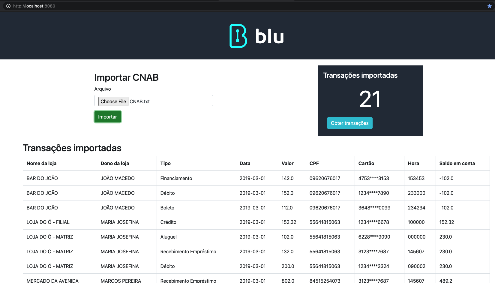

# Desafio back-end de Naiguel Santos

## Dependência
- Docker 20.10.5

## Projetos desenvolvidos com:
#### Microsserviço:
- Ruby 3.0.1
- Rails 6.1.3.1
#### Front-end:
- VueJS 2.6.11

## Executando o microsserviço:

Abra o terminal na raiz do projeto e entre pasta `microservice`:

`cd microservice`

Executar comando para construir os projeto back-end:

`docker-compose build`

Executar o comando para inicializar:

`docker-compose up -d`

Executar o comando para criar o banco de dados:

`docker-compose exec api rake db:create`

Executar o comando para migrar o banco de dados:

`docker-compose exec api rake db:migrate`

Executar o comando para efetuar o pré cadastro dos tipos de transações:

`docker-compose exec api rake db:seed`

## Rodando os testes automatizados

Execute o comando:

`docker-compose exec api bundle exec rspec`

## Executando o front-end:

Abra um novo terminal na raiz do projeto e entre na pasta  `client`:

`cd client`

Executar comando para construir o projeto:

`docker-compose build`

Executar o comando para inicializar o projeto:

`docker-compose up -d`

Acesse o endereço http://localhost:8080